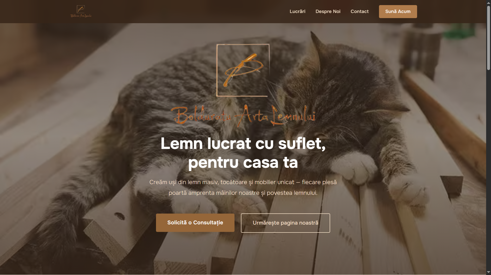
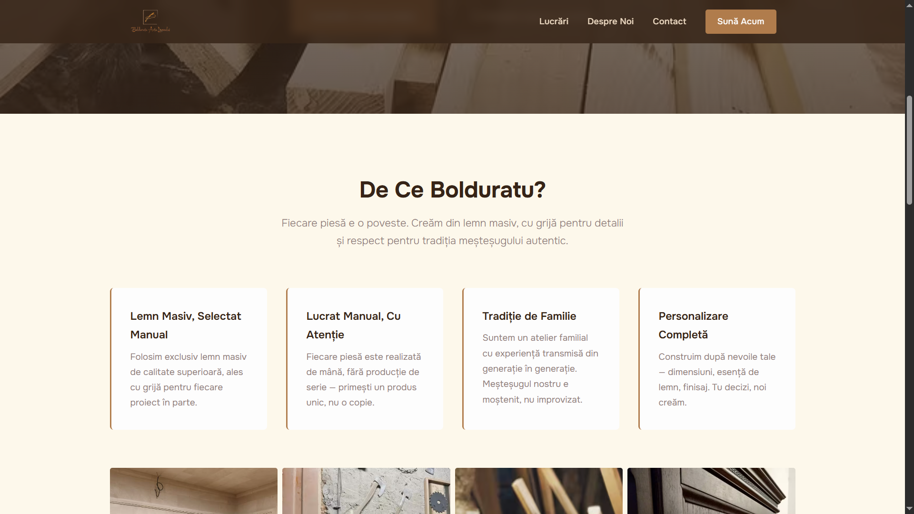
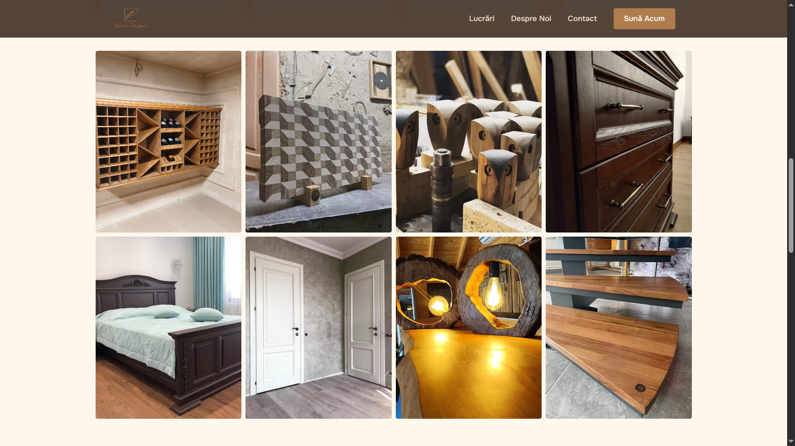
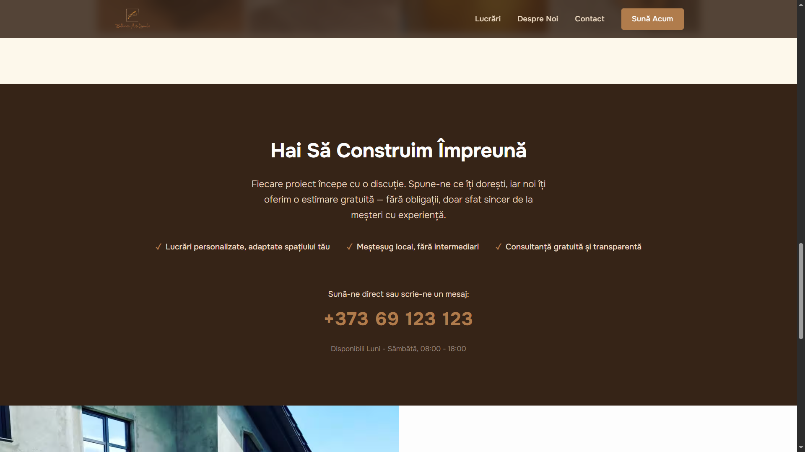
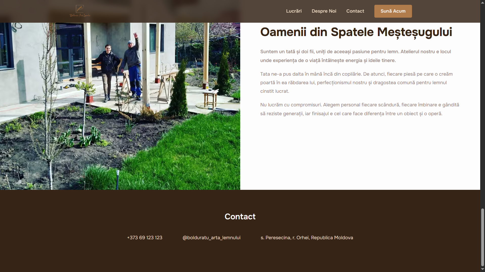

# Landing Page

A static landing page for **Bolduratu Arta Lemnului**, a family-owned woodworking shop specializing in handcrafted
wooden products. Built with pure HTML and CSS, the page showcases authentic craftsmanship, tradition, and attention to
detail.

## About

Bolduratu Arta Lemnului is a woodworking atelier. They create custom wooden doors, cutting boards, furniture, and
interior wood elements—each piece handmade with care and expertise passed down through generations.

The landing page aims to:

- Present the craftsmanship and family tradition
- Build trust with potential customers
- Convert visitors into inquiries via phone calls
- Showcase completed work through a photo gallery

## Features

- **Hero Section** — Clear value proposition with background image overlay
  
- **Value Proposition** — Four key differentiators highlighting material quality, handmade process, family tradition,
  and customization
  
- **Photo Gallery** — Static grid showcasing 8 completed projects
  
- **Call-to-Action Section** — Dedicated conversion block with prominent phone number and trust-building copy
  
- **Team Section** — Personal story introducing the family behind the craft
- **Contact Footer** — Phone number, Instagram link, and location
  
